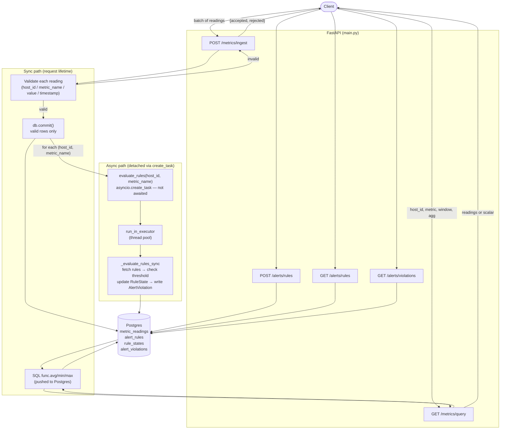
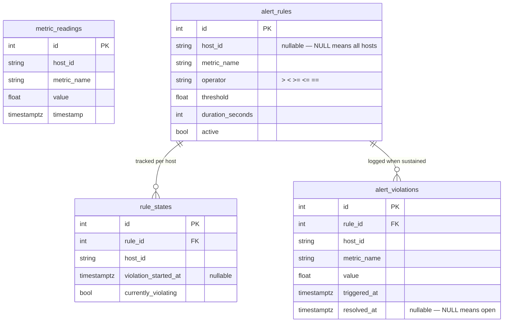

# Architecture

## System flow

## Database schema

## Sync path: ingestion → validation → storage → query

`POST /metrics/ingest` accepts a batch of readings and validates each one independently. Valid readings are written to `metric_readings` in a single `db.commit()`; invalid ones are returned in a `rejected` list with their index and reason. The response always returns `200` with `{accepted, rejected}` — a partial-accept design rather than whole-batch-reject.

**Why partial-accept?** Infrastructure metric streams come from many hosts simultaneously. Rejecting an entire batch because one host sent a malformed value would silently drop valid readings from every other host in the same request. Partial-accept isolates the bad entry while preserving the rest, which matters more as batch size grows.

`GET /metrics/query` supports both raw and aggregated reads. For aggregation, `func.avg`, `func.min`, and `func.max` are pushed directly into the SQL query rather than fetching raw rows and computing in Python. This keeps the data transfer minimal (one scalar versus potentially thousands of rows) and offloads the computation to Postgres, which is better equipped to run it efficiently with indexes. An empty window returns `null` from the DB scalar, which the endpoint returns as-is — no divide-by-zero risk.

## Async path: ingestion decoupled from rule evaluation

After the ingestion DB commit, the endpoint collects the set of `(host_id, metric_name)` pairs that were successfully stored and calls `asyncio.create_task(evaluate_rules(host_id, metric_name))` for each one. The endpoint then returns immediately — it does not `await` the tasks.

`evaluate_rules` is an async coroutine that delegates its DB work to a thread pool via `loop.run_in_executor(None, _evaluate_rules_sync, ...)`. This matters because SQLAlchemy's sync session is blocking I/O. Running it in the executor keeps the event loop free to handle other requests while the evaluator is waiting on Postgres.

**What the latency test proves:** `test_ingest_latency_unaffected_by_slow_evaluator` patches `evaluate_rules` to `await asyncio.sleep(2.0)` and asserts the ingest response returns in under 1000ms. If `create_task` were replaced with `await`, the response would take 2000ms+ and the assertion would fail. The test is a direct falsifiable proof of the decoupling contract.

## Rule evaluator state machine

Each `(rule_id, host_id)` pair has a `RuleState` row that tracks:

- `currently_violating` — whether the threshold is currently being breached
- `violation_started_at` — when the breach streak began

On each evaluation:

1. Fetch the most recent reading for `(host_id, metric_name)`.
2. Check it against `rule.operator` and `rule.threshold`.
3. **If breaching and `currently_violating` is False:** set `currently_violating = True`, record `violation_started_at = now`. No violation is written yet.
4. **If breaching and `currently_violating` is True:** compute `elapsed = now - violation_started_at`. If `elapsed >= duration_seconds` and no open `AlertViolation` exists for this pair, insert one and log a warning. The open-violation check prevents duplicate rows on every subsequent evaluation.
5. **If not breaching and `currently_violating` is True:** reset state (`currently_violating = False`, `violation_started_at = None`) and set `resolved_at = now` on any open `AlertViolation`. The next crossing restarts the timer from zero — it does not inherit the old `violation_started_at`.
6. **If not breaching and `currently_violating` is False:** no state change.

A rule with `host_id = NULL` applies to all hosts. The evaluator query uses `OR (host_id = ? OR host_id IS NULL)` to match both host-specific and global rules.

## Known limitations and production changes

**Time-series storage:** Plain `metric_readings` rows with a `timestamp` index work for a prototype. At production scale, the right move is the TimescaleDB extension: automatic time-based partitioning (hypertables), chunk-level compression, and built-in retention policies via `add_retention_policy`. This would also unlock continuous aggregates — pre-computed rollups that make the `/metrics/query` agg path near-instant even over months of data.

**Connection pooling:** `create_engine` here uses SQLAlchemy's built-in pool (5 connections by default). Under real load, the better approach is an external pool like PgBouncer in transaction mode, which multiplexes many application threads/coroutines over a small number of actual Postgres backend connections — critical when deploying multiple instances on App Platform.

**Async DB driver:** Using a sync SQLAlchemy session inside `run_in_executor` works but burns a thread-pool slot for every DB call. For production, switching to `asyncpg` + SQLAlchemy 2.x async sessions would let the evaluator `await` DB calls without blocking a thread, and remove the `run_in_executor` wrapper entirely.

**Rule evaluator granularity:** The current evaluator checks only the most recent reading per evaluation cycle. If a batch arrives with a spike-then-recovery in the same request, the spike is never seen because only the last reading is checked. For stricter alerting, the evaluator should scan all readings within the `duration_seconds` window and verify none of them dropped below the threshold.

**Evaluator fan-out:** `create_task` per `(host_id, metric_name)` pair is fine at low scale. At high ingest volume, this could create a large number of concurrent tasks. A more scalable approach is a dedicated task queue (Celery + Redis, or a Postgres-backed queue like `pgqueuer`) that decouples evaluation throughput from ingestion rate.
